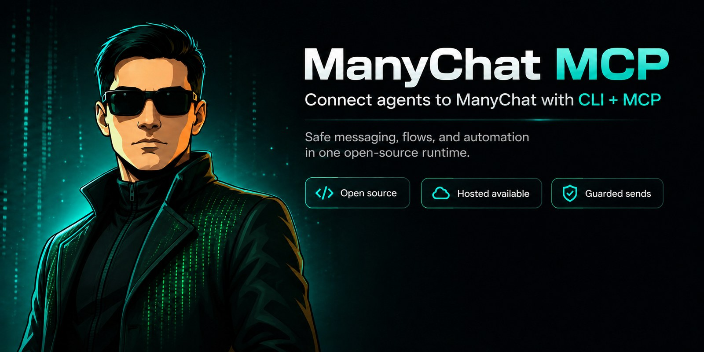

<p align="center">
  
</p>

<h1 align="center">ManyChat MCP</h1>

<p align="center"><strong>Run ManyChat from an AI agent. Every send is checked against Meta's messaging rules first.</strong></p>

<p align="center">
  <a href="LICENSE"></a>
  <a href="docs/deploy/vps-docker.md"></a>
  
</p>

<p align="center">🌐 <strong>English</strong> · <a href="README.es.md">Español</a> · <a href="NOTICE.md">Licence notice</a></p>

A CLI and a Model Context Protocol server for the ManyChat Account Public API. Claude, Cursor,
Codex and any other MCP client get 28 tools to read and segment subscribers, manage tags and
custom fields, send flows and messages, and inspect a page.

The part you cannot get from a thin API wrapper is `validate_message`. It reads a proposed
send against Meta's 24-hour window, message tags and opt-in state, and returns a verdict.
`send_text_message` and `send_content` run the same check and refuse a blocked send. See
[The policy wedge](#the-policy-wedge).

---

## Run it

```bash
npx mcp-manychat connect
```

`connect` prints where to generate a ManyChat API key, how to store it, and a config block
you can paste into your agent.

Working from source instead:

```bash
git clone https://github.com/WIZNEOAI/Manychat-MCP.git
cd Manychat-MCP
pnpm install && pnpm build
node dist/index.js connect
```

### Don't want to run a local process?

Two different things, do not mix them:

1. **Public HTTP gateway** — already live at [mcp.wizneo.org](https://mcp.wizneo.org).
   Bring your own ManyChat key on `X-ManyChat-API-Key`. We do not store it. Fine for trying
   the remote transport. For production, run Docker yourself.
2. **Hosted control plane** — vault + revocable MCP tokens. **Not open yet.**
   [mc-mcp.wizneo.org](https://mc-mcp.wizneo.org) describes it and says so plainly; there is
   no sign-up to send you to today.

The hosted plane will be a convenience, not a better version. Every tool, every prompt and
the policy guard are here, under AGPL. **The OSS runtime is never a gated demo.**

---

### Step 1 — get your ManyChat API key

In ManyChat: **Settings → API → Generate your API Key**. Requires a ManyChat **Pro**
account. ([Official instructions](https://help.manychat.com/hc/en-us/articles/14959510331420-How-to-generate-a-token-for-the-Manychat-API-and-where-to-get-parameters).)

> **The key is shown once.** Copy it before you close that screen. If you lose it you have
> to generate a new one, which invalidates the old one and breaks anything using it. The
> key grants full access to the page it belongs to, so treat it like a password.

### Step 2 — store it as an environment variable

```bash
export MANYCHAT_API_KEY='mc_your_key_here'
```

That only lives in the current shell. To keep it, append the same line to `~/.zshrc`
(macOS) or `~/.bashrc` (Linux), then open a new terminal.

Running more than one ManyChat account? Use a profile file instead — `~/.manychat/config.json`:

```json
{
  "profiles": {
    "default":  { "apiKey": "mc_your_key_here" },
    "clientA":  { "apiKey": "mc_a_different_key" }
  }
}
```

Then pass `--profile clientA` (or set `MANYCHAT_PROFILE=clientA`).

**Don't:** commit the key to a repo · pass `--api-key` on a shared machine, where it lands
in your shell history · paste it into an AI chat. The MCP server reads it from the
environment; it never needs to appear in a message.

### Step 3 — verify

```bash
manychat doctor      # checks the key and connectivity
manychat page info   # prints your page
```

## Connect your agent

The MCP server runs locally over stdio. `manychat connect` prints these filled in with your
real paths, but for reference:

**Claude Desktop / Claude Code** (`claude_desktop_config.json` or `.mcp.json`):

```json
{
  "mcpServers": {
    "manychat": {
      "command": "npx",
      "args": ["-y", "mcp-manychat", "mcp", "serve", "--transport", "stdio"],
      "env": { "MANYCHAT_API_KEY": "mc_..." }
    }
  }
}
```

**Cursor** (`~/.cursor/mcp.json`): same shape as above.

**Codex** (`~/.codex/config.toml`):

```toml
[mcp_servers.manychat]
command = "npx"
args = ["-y", "mcp-manychat", "mcp", "serve", "--transport", "stdio"]
env = { MANYCHAT_API_KEY = "mc_..." }
```

Working from a clone instead of npm? Swap `command`/`args` for
`"node"` and `["/absolute/path/to/dist/index.js", "mcp", "serve", "--transport", "stdio"]`.
The path must be absolute, because MCP clients resolve it from their own working
directory.

Remote (HTTP) and hosted-token modes are documented in [`docs/connect/mcp-clients.md`](docs/connect/mcp-clients.md).

## What your agent gets

**28 tools**:

| Group | Tools |
|---|---|
| Page & policy | `get_page_info`, `validate_message` (policy wedge), `health_check`, `list_bot_fields`, `set_bot_field`, `list_growth_tools`, `list_otn_topics` |
| Subscribers | `get_subscriber`, `find_subscriber_by_email`, `find_subscriber_by_phone`, `find_subscriber_by_name`, `create_subscriber`, `update_subscriber`, `add_tag_to_subscriber`(`_by_name`), `remove_tag_from_subscriber`(`_by_name`) |
| Tags | `list_tags`, `create_tag` |
| Custom fields | `list_custom_fields`, `create_custom_field`, `set_custom_field`(`_by_name`), `set_custom_fields_bulk` |
| Flows | `list_flows`, `send_flow` |
| Messaging | `send_content`, `send_text_message` |

**6 prompts**, each a multi-step playbook the agent can run: `onboard_subscriber`,
`recover_lead`, `send_campaign`, `analyze_subscriber`, `segment_audience`,
`diagnose_automation`.

**8 resources** the agent can read without spending a tool call: `page-info`, `tag-catalog`,
`custom-fields-catalog`, `bot-fields`, `flow-catalog`, `otn-topics`, `subscriber-schema`,
`api-limits`.

## The policy wedge

Meta enforces messaging windows (the 24-hour rule, message-tag limits, WhatsApp templates).
An agent that sends blindly gets the page restricted. Before a send, call:

```jsonc
validate_message({ channel: "messenger", hours_since_last_interaction: 30, promotional: true })
// → {
//   "level": "block",
//   "allowed": false,
//   "findings": [{
//     "code": "OUTSIDE_WINDOW_NO_TAG",
//     "level": "block",
//     "rule": "24h-window",
//     "message": "Outside the 24h window with no message tag. Re-engage the subscriber or use a valid tag."
//   }]
// }
```

You supply the window (`hours_since_last_interaction`); the tool does not go and fetch it,
so an unknown window is treated as outside. The rules live in
[`src/policy/`](src/policy/) and cover opt-in, the valid message tags, the `HUMAN_AGENT`
7-day window, promotional content under a non-promotional tag, and the WhatsApp template
requirement. `send_text_message` and `send_content` run the same verdict and refuse a
blocked send unless you pass `override_policy`, which is per-call and logged.

This guard stays in the OSS layer.

## Agent skills

Six installable skills wrap common operator workflows: `manychat-operator`,
`manychat-lead-reply`, `manychat-followup-os`, `manychat-growth-engine`,
`manychat-setup-coach` and `manychat-mcp-ops`. They are playbooks, not extra permissions —
every send still goes through the policy guard.

They live in [`skills/`](skills/); see [`skills/README.md`](skills/README.md) for what each
one is for, and [`docs/connect/agent-skills.md`](docs/connect/agent-skills.md) for how to
install them.

## CLI

The CLI is the source of truth; MCP reuses the same execution layer.

```
manychat connect               # start here
manychat doctor
manychat page info
manychat tags list|create
manychat fields list|create|set|set-bulk
manychat flows list|send
manychat subscribers get|find|create|update
manychat subscribers tags add|remove
manychat send text|content
manychat raw get|post
manychat mcp serve
```

Output contract: JSON on `stdout`, diagnostics on `stderr`. Exit codes: `0` ok · `2` bad input · `3` auth/config · `4` API error · `5` rate limit.

## Hosted (Revenue Operator)

**Not open yet.** What follows is what the paid layer will add on top of this runtime, and
none of it is required to use anything above: an **encrypted credential vault**, so a
ManyChat key is pasted once and never shown again; **revocable MCP tokens** issued per agent
instead of handing out the raw key; **usage and audit** per workspace; and enforced plan
ceilings.

Three tiers — **Free** for evaluation, **Supporter** for builders running agents daily,
**Pro** for agencies and multi-brand operators. Prices and per-tier limits live on the
product page, which is the single source of truth for them; this README deliberately does
not restate numbers it cannot enforce.

The control plane is a separate, proprietary codebase. Nothing here depends on it: the
gateway talks to it over the three endpoints in
[`docs/control-plane-contract.md`](docs/control-plane-contract.md), and only when you set
`MCP_REMOTE_AUTH=hosted_token`. Every other mode runs standalone.

## Self-host the gateway

For a persistent multi-tenant remote MCP, deploy the gateway (`src/`, Dockerfile,
`GET /health`) to any container host. Guides:
[Docker on a VM](docs/deploy/vps-docker.md) ·
[gateway on a VPS](docs/deploy/mcp-gateway-vps.md) ·
[Railway](docs/deploy/railway.md).

The server is stateless per MCP revision `2026-07-28`, so you can run several replicas
behind a plain round-robin load balancer with no sticky routing.

## Development

```bash
pnpm install
pnpm run lint     # tsc --noEmit
pnpm run build    # tsc
pnpm test         # vitest
```

All three must pass before a commit. **There is no CI on this repository**: the gate is
local, and every contributor runs it. A pull request that says the gate is green is taken at
its word, so please make that true. See [`CONTRIBUTING.md`](CONTRIBUTING.md) for what we look for in a change, plus
[`CLAUDE.md`](CLAUDE.md) and [`AGENTS.md`](AGENTS.md).

## Safety

- Never assume a send is safe outside the 24-hour window — use `validate_message`.
- Don't rely on Message Tags as a default Messenger fallback after 2026-02-09.
- Read-before-write, verify-after-write for mutations.

## Licence

**[AGPL-3.0-or-later](LICENSE).** Run it, fork it, sell services built on it — including
commercially. What the licence asks in return: if you run a **modified** version as a
network service, you owe its users the complete corresponding source of what you are
running.

So you can build a business on this. You cannot build a closed one.

Separately, a copyright licence is not a trademark licence: **Gnosix**, **WIZNEO**,
**Revenue Operator** and our visual identity are reserved. Ship your fork under a name
that is clearly yours.

Plain-language summary in both English and Spanish, including how credentials are handled:
**[NOTICE.md](NOTICE.md)**.

---

Built by [Gnosix / WIZNEO](https://wizneo.org). **Not affiliated with, endorsed by, or
sponsored by ManyChat, Inc.** — "ManyChat" is a trademark of its owner, used here only to
describe what this software talks to.
