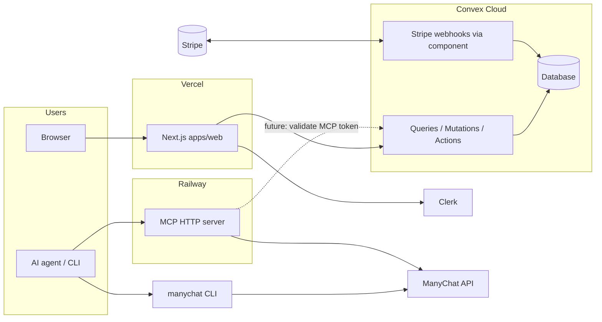

# Action plan: Convex + Clerk + Stripe (Vercel + Railway)

This document is the **implementation blueprint** for evolving the hosted product while
keeping the repository **English-first**, **CLI-first**, and **OSS-friendly**.

## Goals

1. **Dashboard and billing** on **Vercel** (`apps/web`): Next.js, **Clerk** auth, **Convex**
   backend, **Stripe** subscriptions via the official **`@convex-dev/stripe`** component.
2. **Remote MCP** remains a **separate deploy** on **Railway** (or similar): same HTTP MCP
   entrypoint as today, with tenant resolution against Convex-issued credentials (future
   step).
3. **Pricing**: generous **Free** (sign up, no manual approval), **Pro at USD 20/month**
   for higher limits and project sustainability; copy and UI in **English only**.
4. **CLI** stays the primary surface for AI agents and automation; MCP is optional
   transport. Document which **MCP clients** we support first-class (Cursor, Claude Code,
   Codex, Claude Desktop, etc.) in `docs/connect/mcp-clients.md` and the web app.

## Non-goals (for this phase)

- Rewriting the ManyChat execution core in Convex actions (keep `src/core` as source of
  truth; hosted gateway **calls** or **reuses** that logic via HTTP/internal bridge later).
- Full team RBAC before Pro is stable (start with workspace owner = Clerk user).

---

## Target architecture

| Layer | Responsibility |
| --- | --- |
| **Clerk** | Human sign-in for the dashboard; JWT for Convex `auth`. |
| **Convex** | Workspaces, plan entitlements, usage counters, Stripe subscription state, metadata for ManyChat accounts and MCP tokens (secrets handled per security section). |
| **Stripe** | Checkout, Customer Portal, webhooks; synced by `@convex-dev/stripe`. |
| **Vercel** | Host `apps/web`; env for Clerk, Convex, Stripe *publishable* keys only. |
| **Railway** | Host `npm run start:mcp:http` (or Docker equivalent); env for Convex URL + shared secret or JWT verification for MCP tokens (phase 2). |

---

## Product and pricing (English copy)

| Plan | Price | Intent |
| --- | --- | --- |
| **Free** | $0 | Sign up with Clerk; immediate access; capped usage (workspaces, accounts, requests, concurrency). No manual approval. |
| **Pro** | **$20/month** | Higher limits, priority positioning; supports ongoing OSS + hosted development. |

All **marketing, docs, dashboard strings, and issue templates** should be **English**
for the public open-source repo.

---

## Phase 0 — Repository and conventions

1. Add **`convex/`** at repo root (or `apps/web/convex` if you standardize on colocated
   Convex + Next; official templates often use root `convex/` with Next in `apps/web`).
2. **English-only** pass on `apps/web` copy and `docs/product/*` where still mixed.
3. Document env matrix (see below) in this file and in `README.md` (short table + link).

## Phase 1 — Clerk + Convex in `apps/web`

**Repo status:** `apps/web` includes Convex (`users`, `workspaces`), Clerk middleware,
`ConvexProviderWithClerk`, and **Stripe** via `@convex-dev/stripe` (`convex.config.ts`,
`http.ts` webhook route, checkout + portal actions, workspace `plan` sync on subscription
events). Configure Convex env vars and Stripe webhooks per `apps/web/README.md`.

Official references:

- Convex + Clerk: [Convex Clerk auth](https://docs.convex.dev/auth/clerk)
- Clerk + Convex: [Clerk Convex integration](https://clerk.com/docs/guides/development/integrations/databases/convex)

Steps:

1. Create Convex project; run `npx convex dev` / deploy.
2. Enable Clerk integration for Convex; add `convex/auth.config.ts` with Clerk issuer.
3. Wrap app with `ClerkProvider` → `ConvexProviderWithClerk` (order per docs).
4. Add protected routes for `/dashboard/*`; public landing + docs remain public.

**Deliverable**: signed-in user can load dashboard shell with real `ctx.auth` in Convex.

## Phase 2 — Data model (Convex schema)

Minimal tables (names indicative):

- `users` — mirror Clerk `subject` + email (from identity), `createdAt`.
- `workspaces` — `name`, `ownerUserId`, `plan` (`free` | `pro`), `stripeCustomerId` (optional, from Stripe component).
- `workspaceMembers` — later for teams; v1 can be owner-only.
- `manychatAccounts` — `workspaceId`, `displayName`, `default`, **no plaintext key in plain fields**.
- `usageDaily` / `usageMonthly` — counters for metering (requests, sessions).
- `mcpTokens` — `workspaceId`, `hash` or `prefix`, `scopes`, `revokedAt` (full secret shown once at creation).

ManyChat API key storage:

- **Never** store raw keys in a client-accessible Convex query.
- Prefer **encryption** (envelope) using a secret available only to Convex **actions** /
  Node runtime, or a dedicated secrets API. Document the chosen approach before launch.
- Align fields with [control-plane-contracts.md](./control-plane-contracts.md).

## Phase 3 — Stripe (`@convex-dev/stripe`)

Official: [Convex Stripe component](https://www.convex.dev/components/stripe), package
`@convex-dev/stripe`, template [Stripe Starter](https://convex.dev/templates/stripe).

Steps:

1. `npm install @convex-dev/stripe`; register in `convex/convex.config.ts`.
2. Set Convex dashboard env: `STRIPE_SECRET_KEY`, `STRIPE_WEBHOOK_SECRET`.
3. Register HTTP route for Stripe webhooks (component provides `registerRoutes` pattern).
4. Create **Products/Prices** in Stripe: **Pro** = $20/month recurring.
5. Dashboard: “Upgrade to Pro” → Checkout Session; link to **Customer Portal** for
   cancel/update card.

**Deliverable**: test mode subscription toggles `plan` in Convex; gated UI reflects Pro.

## Phase 4 — Entitlements and usage

1. Central `getEntitlements(workspaceId)` returning limits (from
   [pricing-tiers.md](./pricing-tiers.md) + your final numbers).
2. Increment usage in actions that proxy ManyChat calls or in MCP gateway (later).
3. Soft-limit responses with clear English errors when over quota.

## Phase 5 — Railway MCP + Convex bridge

1. Keep **current** HTTP MCP server on Railway (`start:mcp:http`).
2. Add **verification** of hosted MCP tokens (JWT or opaque token id + HMAC) issued by
   Convex action and stored hashed server-side.
3. Railway env: `CONVEX_DEPLOYMENT_URL` or internal HTTP action URL, **shared signing
   secret**, no Clerk on Railway required for MCP if tokens are self-contained.

**Deliverable**: remote MCP with **product token** only; ManyChat key resolved server-side
from Convex-stored ciphertext (via action or sync — architecture choice in Phase 2).

## Phase 6 — CLI and MCP clients (documentation)

1. **CLI**: unchanged install path; document “for agents, prefer CLI or local MCP” in
   English.
2. **First-class MCP clients** (prioritize in docs and snippets): **Cursor**, **Claude
   Code**, **Codex**, **Claude Desktop**, **Antigravity** (if still relevant).
3. Single **“Connect”** page in `apps/web` with per-client config blocks.

---

## Environment variables (checklist)

### Vercel (`apps/web`)

| Variable | Purpose |
| --- | --- |
| `NEXT_PUBLIC_CLERK_PUBLISHABLE_KEY` | Clerk browser SDK |
| `CLERK_SECRET_KEY` | Clerk server |
| `NEXT_PUBLIC_CONVEX_URL` | Convex client |
| `CONVEX_DEPLOY_KEY` | Optional deploy from CI |
| `NEXT_PUBLIC_STRIPE_PUBLISHABLE_KEY` | Stripe Checkout (client) |

### Convex Dashboard

| Variable | Purpose |
| --- | --- |
| `CLERK_JWT_ISSUER_DOMAIN` / issuer config | Auth |
| `STRIPE_SECRET_KEY` | Stripe API |
| `STRIPE_WEBHOOK_SECRET` | Webhook verification |
| Encryption / signing secrets | ManyChat vault + MCP tokens |

### Railway (MCP service)

| Variable | Purpose |
| --- | --- |
| `NODE_ENV=production` | Production mode |
| `MCP_REMOTE_AUTH` | Token auth mode for hosted |
| `PORT` | Listen port |
| Token verification secret / Convex callback | Validate MCP tokens |

---

## Risk register

| Risk | Mitigation |
| --- | --- |
| ManyChat keys in Convex | Encrypt; never return to client; audit queries. |
| Stripe webhook drift | Use official component; test mode first. |
| MCP + Convex latency | Cache workspace resolution; keep MCP on Railway close to users. |
| Scope creep | Ship Clerk + Convex + Stripe + empty vault before full MCP token issuance. |

---

## Suggested order of execution (sprints)

1. **Sprint A**: Convex init + Clerk + protected dashboard layout (English).
2. **Sprint B**: Schema + workspace CRUD + Free defaults.
3. **Sprint C**: Stripe component + Pro checkout + portal + `plan` sync.
4. **Sprint D**: ManyChat account metadata + encrypted vault write path (no MCP yet).
5. **Sprint E**: MCP token issuance + Railway verification + usage counters.

---

## Related internal docs

- [hosted-control-plane.md](./hosted-control-plane.md)
- [control-plane-contracts.md](./control-plane-contracts.md)
- [repository-evolution.md](./repository-evolution.md)
- [pricing-tiers.md](./pricing-tiers.md)
- [open-source-saas-blueprint.md](../open-source-saas-blueprint.md)
